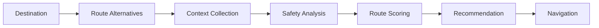
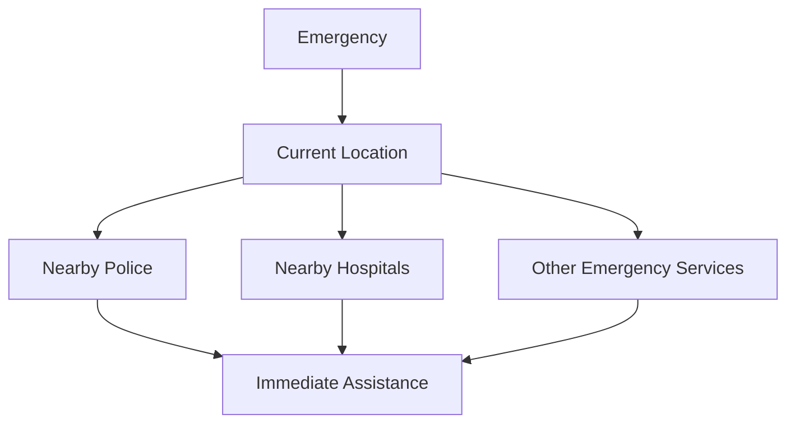
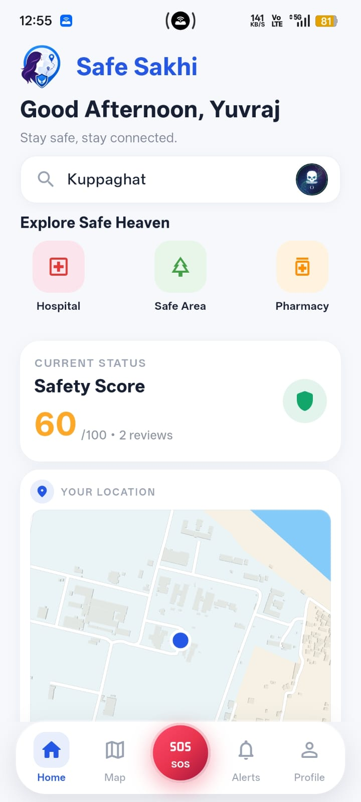
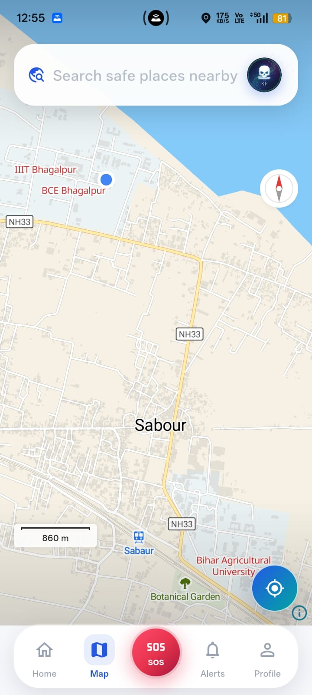
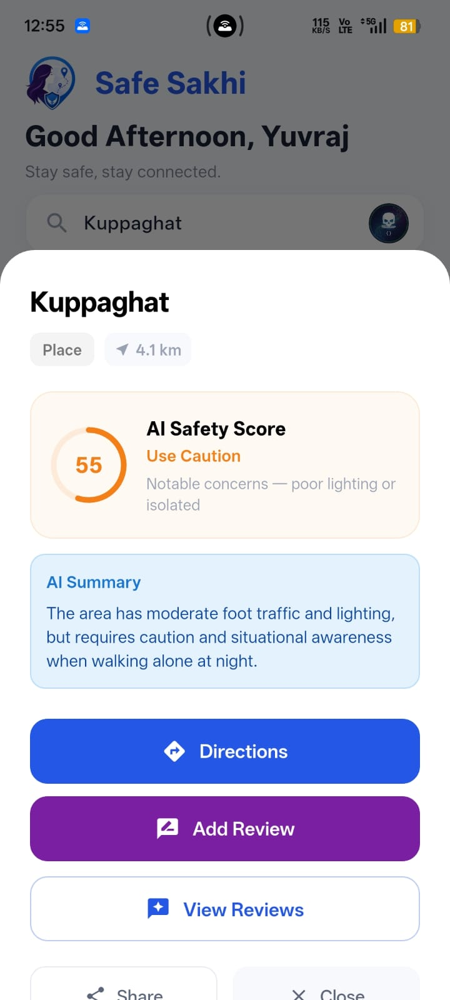
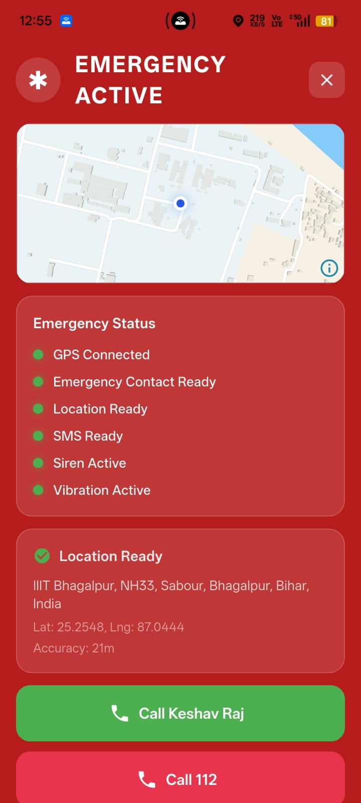

<div align="center">


<br><br>


<br>

<p>
  <strong>AI-assisted safety intelligence for everyday journeys.</strong>
</p>

<br>

<a href="#about">About</a>
  •   <a href="#features">Features</a>
  •   <a href="#how-it-works">How it works</a>
  •   <a href="#technology">Technology</a>
  •   <a href="#team">Team</a>

<br><br>


<br><br>


</div>

---

## About

**SafeSakhi** is a safety-focused mobility application designed to make everyday route decisions more informed.

Most navigation systems primarily optimize for **time and distance**.

SafeSakhi adds another layer of context.

Instead of asking only:

> *"What is the fastest way there?"*

SafeSakhi also considers:

> *"Which available route has stronger safety-related signals?"*

The system evaluates contextual information such as emergency-service proximity, community feedback, network availability, lighting and other environmental signals to generate a **safety-aware route recommendation**.

SafeSakhi is a recommendation system — **not a guarantee of safety**.

---

## The Idea

<div align="center">

```text
                     DESTINATION
                          │
                          ▼
                ┌──────────────────┐
                │  ROUTE OPTIONS   │
                └────────┬─────────┘
                         │
                         ▼
              ┌──────────────────────┐
              │  SAFETY INTELLIGENCE │
              └──────────┬───────────┘
                         │
          ┌──────────────┼──────────────┐
          │              │              │
       Emergency      Community      Environment
        Access         Signals         Signals
          │              │              │
          └──────────────┼──────────────┘
                         │
                         ▼
                ┌──────────────────┐
                │ SAFETY-AWARE     │
                │ RECOMMENDATION   │
                └────────┬─────────┘
                         │
                         ▼
                    YOUR ROUTE
```

</div>

---

## Features

### Safety-aware route recommendations

Routes are evaluated using more than travel time and distance.

The recommendation can incorporate:

* proximity to police stations
* proximity to hospitals and pharmacies
* community-generated information
* network availability
* lighting and visibility indicators
* surrounding-area context
* route characteristics

---

### Emergency assistance

Emergency functionality is accessible directly from the application, allowing users to quickly reach relevant assistance and discover nearby emergency services.

---

### Community intelligence

Local experiences can provide context that conventional map data cannot.

Community reports and observations contribute another layer of information to the safety analysis.

---

### Saved places

Frequently visited destinations can be saved for quick access, reducing friction when planning a journey.

---

## How It Works



### Route analysis

For every candidate route, SafeSakhi gathers available contextual signals.

```text
Route
  │
  ├── Travel time
  ├── Distance
  ├── Emergency-service proximity
  ├── Healthcare accessibility
  ├── Community information
  ├── Network availability
  ├── Lighting / visibility
  └── Environmental context
             │
             ▼
       Safety analysis
             │
             ▼
    Route recommendation
```

The system does **not** claim that a higher score means a location is objectively safe.

It represents the quality of the available safety-related signals.

---

## Example

A conventional navigation system may prefer:

```text
Route A
1.8 km
10 minutes
```

SafeSakhi may instead recommend:

```text
Route B
2.1 km
12 minutes
```

if Route B has stronger available indicators such as better emergency-service accessibility, better connectivity or stronger community information.

The objective is not to sacrifice efficiency unnecessarily.

It is to find a better **balance between mobility and safety context**.

---

## Emergency Layer



The emergency layer is intentionally designed to minimize the number of steps between the user and relevant assistance.

---

## Technology

<div align="center">

| Layer          | Technology                  |
| :------------- | :-------------------------- |
| Application    | Flutter                     |
| Language       | Dart                        |
| Maps           | Google Maps Platform        |
| Backend        | Firebase                    |
| Authentication | Firebase Authentication     |
| Database       | Cloud Firestore             |
| Location       | Device Location Services    |
| Intelligence   | AI-assisted safety analysis |

</div>

---

## Architecture

```text
                         SafeSakhi
                             │
                  ┌──────────┴──────────┐
                  │                     │
             Flutter App            Firebase
                  │                     │
        ┌─────────┼─────────┐     ┌─────┴─────┐
        │         │         │     │           │
       Maps    Location    SOS   Auth      Firestore
        │         │         │     │           │
        └─────────┴─────────┴─────┴───────────┘
                             │
                             ▼
                    Safety Intelligence
                             │
                             ▼
                    Route Recommendation
```

---

## Product Preview

> Add your screenshots inside `screenshots/`.

<div align="center">

      

<br><br>



</div>

---

## Why SafeSakhi?

Navigation has become extremely good at answering one question:

**How do I get there?**

SafeSakhi explores another question:

**How can the journey itself be made more safety-aware?**

```text
                    NAVIGATION
                         +
                 SAFETY CONTEXT
                         +
               COMMUNITY SIGNALS
                         +
                EMERGENCY ACCESS
                         │
                         ▼
                     SAFESAKHI
```

---

## Roadmap

```text
CURRENT
  │
  ├── Safety-aware routing
  ├── Emergency discovery
  ├── Community layer
  ├── Saved places
  └── Firebase integration
        │
        ▼
NEXT
  │
  ├── Time-of-day analysis
  ├── Improved safety datasets
  ├── Dynamic network intelligence
  ├── Better community reputation
  └── Personalized route preferences
        │
        ▼
FUTURE
  │
  ├── Real-time safety signals
  ├── Trusted-contact integration
  ├── Public safety datasets
  ├── Regional language support
  └── Multi-city expansion
```

---

## Safety Disclaimer

SafeSakhi does not guarantee that a route, location or journey is safe.

Safety conditions can change rapidly and available data may be incomplete, outdated or inaccurate.

The application's scores and recommendations are intended as **decision-support information** and should not replace personal judgment or appropriate emergency services.

---

## Hackfest 2026

<div align="center">


<br><br>

**Built for Hackfest 2026**

<br>

*Safer routes. Smarter decisions.*

<br><br>


</div>

---

## Team

<div align="center">

<a href="https://github.com/YOUR_USERNAME">

</a>

    

<a href="https://github.com/CONTRIBUTOR_2">

</a>

    

<a href="https://github.com/CONTRIBUTOR_3">

</a>

<br><br>

**YOUR NAME**    ·    **CONTRIBUTOR 2**    ·    **CONTRIBUTOR 3**

<br>

`Development`     `Design`     `Research`

</div>

---

<div align="center">


<br><br>

**SafeSakhi**

*Navigate with confidence.*

</div>
